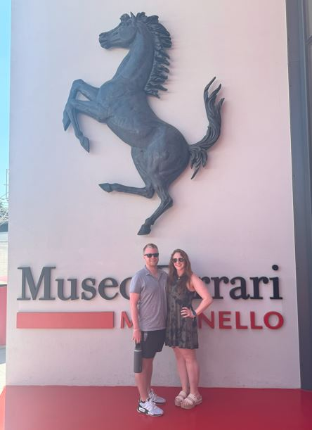

# Chase Rushton's Portfolio Website

<div align="center">

[](https://github.com/ChaseRushton/chase-main/actions/workflows/deploy.yml)
[](https://chaserushton.github.io/chase-main/)
[](https://github.com/ChaseRushton/chase-main/commits/main)
[](https://reactjs.org/)
[](https://mui.com/)
[](https://choosealicense.com/licenses/mit/)
[](https://github.com/ChaseRushton/chase-main/commits/main)

<p align="center">
  
</p>

A modern, interactive personal portfolio website built with React, showcasing my professional experience, education, publications, and presentations.

[Live Demo](https://chaserushton.github.io/chase-main/) • [Report Bug](https://github.com/ChaseRushton/chase-main/issues) • [Request Feature](https://github.com/ChaseRushton/chase-main/issues)

</div>

## 🎯 Overview

A personal portfolio website that stands out with:
- 🎨 Modern, minimalist design
- 🌟 Interactive animations
- 📱 Full responsiveness
- ⚡ Optimal performance
- 🔍 SEO optimization

## 🖼️ Preview

<div align="center">
  
  <p><em>Interactive DNA Background & Professional Timeline</em></p>
</div>

## ✨ Features

<table>
  <tr>
    <td align="center">✅ Responsive Design</td>
    <td align="center">✅ Interactive DNA Animation</td>
    <td align="center">✅ Binary Rain Effect</td>
  </tr>
  <tr>
    <td align="center">✅ Smooth Transitions</td>
    <td align="center">✅ Modern UI/UX</td>
    <td align="center">✅ Timeline View</td>
  </tr>
  <tr>
    <td align="center">✅ Publications Section</td>
    <td align="center">✅ Presentations Gallery</td>
    <td align="center">✅ Professional Links</td>
  </tr>
</table>

## 🚀 Quick Start

### Prerequisites

- Node.js >= 14.0.0
- npm >= 6.14.0

### Installation

1. Clone the repository
```bash
git clone https://github.com/ChaseRushton/chase-main.git
```

2. Install dependencies
```bash
cd chase-main
npm install
```

3. Start development server
```bash
npm start
```

4. Open [http://localhost:3000](http://localhost:3000)

## 🛠️ Built With

<table>
  <tr>
    <td align="center">
      
      <br>React
    </td>
    <td align="center">
      
      <br>Material-UI
    </td>
    <td align="center">
      
      <br>CSS3
    </td>
    <td align="center">
      
      <br>JavaScript
    </td>
  </tr>
</table>

## 📁 Project Structure

```bash
chase-main/
├── 📂 public/                # Static files
│   ├── 🖼️ assets/           # Images and media
│   └── 📄 index.html        # HTML template
├── 📂 src/
│   ├── 🧩 components/       # React components
│   ├── 🎨 styles/           # CSS stylesheets
│   ├── 🖼️ assets/          # Component assets
│   ├── 📱 App.js           # Main component
│   └── 🎯 theme.js         # Theme config
└── 📦 package.json         # Dependencies
```

## 📦 Deployment

Deploy to GitHub Pages with one command:

```bash
npm run deploy
```

## 🔄 Updates

1. Modify components in `/src/components`
2. Test changes locally with `npm start`
3. Deploy with `npm run deploy`

## 🎯 Performance Optimizations

- ⚡ Lazy loading of images
- 📦 Code splitting for optimal loading
- 🔍 SEO-friendly meta tags
- 📱 Responsive images for different devices
- 🚀 Minified production build

## 🤝 Contributing

1. Fork the Project
2. Create your Feature Branch (`git checkout -b feature/AmazingFeature`)
3. Commit your Changes (`git commit -m 'Add some AmazingFeature'`)
4. Push to the Branch (`git push origin feature/AmazingFeature`)
5. Open a Pull Request

## 📧 Contact

<div align="center">
  <a href="https://www.linkedin.com/in/chase-rushton/">
    
  </a>
  <a href="https://github.com/ChaseRushton">
    
  </a>
</div>

## 📝 License

This project is licensed under the MIT License - see the [LICENSE](LICENSE) file for details.

---

<div align="center">
  <sub>Built with ❤️ by Chase Rushton</sub>
</div>
